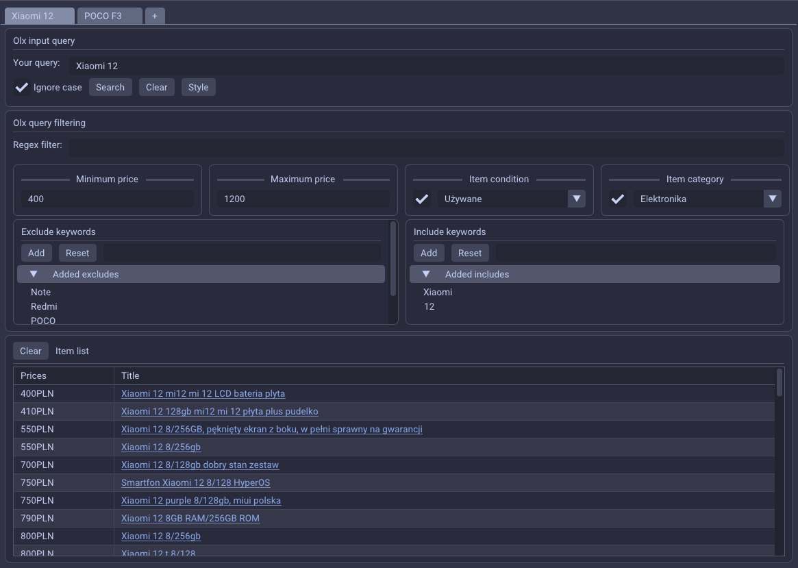

# OlxGui
Quick and dirty gui for olx-find written in 3 days.

## Notice
This program uses olx-find. A CLI tool used for finding OLX offers.  
You need to download and add it to your system PATH.  
You can find the repo here: [link not available yet]  

## Building
Clone the project with the `recursive` flag:
```
$ git clone https://github.com/Kihau/OlxGui.git --recursive
```

Create build directory and:

```
$ cd build/
$ cmake ..
$ cmake --build . --config Release
```

## Dependencies:
- Windows: 
  Only a C++ toolchain, CMake and recursively cloned dependencies should be required to build the project.

- Linux:
  Some external build dependencies used by glfw might be needed to build the project, those include:  
  `wayland`, `ibxkbcommon`, `libXcursor`, `libXi`, `libXinerama`, `libXrandr`
  
  For more info see: [glfw docs](https://www.glfw.org/docs/latest/compile.html)


